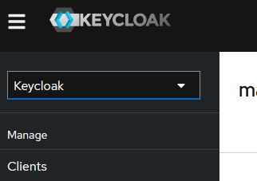
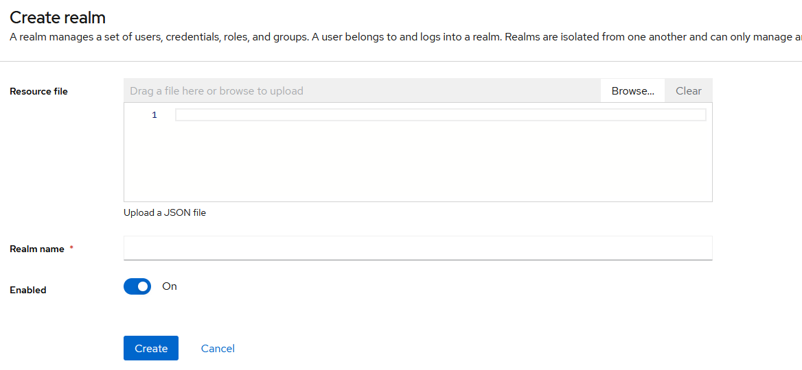
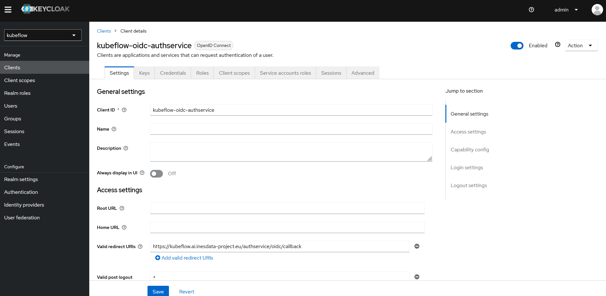

# **Guía de instalación**

---

## Descripción general

Esta guía describe el proceso de instalación de los Manifiestos de Kubeflow sobre los que se basa la plataforma `Inesdata-AI-Services`. Está basada en el repositorio de [Manifiestos de Kubeflow](https://github.com/kubeflow/manifests/tree/v1.8.0). Dicho repositorio es propiedad del [Grupo de Trabajo de Manifiestos](https://github.com/kubeflow/community/blob/master/wg-manifests/charter.md).

El repositorio está organizado en tres (3) directorios principales, que incluyen manifiestos para instalar:

| Directorio | Propósito |
| - | - |
| `apps` | Componentes oficiales de Kubeflow, mantenidos por los respectivos Grupos de Trabajo de Kubeflow |
| `common` | Servicios comunes, mantenidos por el Grupo de Trabajo de Manifiestos |
| `contrib` | Aplicaciones contribuidas por terceros, que se mantienen externamente y no forman parte de un Grupo de Trabajo de Kubeflow |

## Versiones de componentes de Kubeflow

### Versión de Kubeflow: 1.8.0

La siguiente matriz muestra la versión de git que se incluye para cada componente:

| Componente | Ruta de Manifiestos Locales | Revisión Upstream |
| - | - | - |
| Notebook Controller | apps/jupyter/notebook-controller/upstream | [v1.8.0](https://github.com/kubeflow/kubeflow/tree/v1.8.0/components/notebook-controller/config) |
| PVC Viewer Controller | apps/pvcviewer-roller/upstream | [v1.8.0](https://github.com/kubeflow/kubeflow/tree/v1.8.0/components/pvcviewer-controller/config) |
| Central Dashboard | apps/centraldashboard/upstream | [v1.8.0](https://github.com/kubeflow/kubeflow/tree/v1.8.0/components/centraldashboard/manifests) |
| Profiles + KFAM | apps/profiles/upstream | [v1.8.0](https://github.com/kubeflow/kubeflow/tree/v1.8.0/components/profile-controller/config) |
| PodDefaults Webhook | apps/admission-webhook/upstream | [v1.8.0](https://github.com/kubeflow/kubeflow/tree/v1.8.0/components/admission-webhook/manifests) |
| Jupyter Web App | apps/jupyter/jupyter-web-app/upstream | [v1.8.0](https://github.com/kubeflow/kubeflow/tree/v1.8.0/components/crud-web-apps/jupyter/manifests) |
| Volumes Web App | apps/volumes-web-app/upstream | [v1.8.0](https://github.com/kubeflow/kubeflow/tree/v1.8.0/components/crud-web-apps/volumes/manifests) |
| KServe | contrib/kserve/kserve | [v0.13.0](https://github.com/kserve/kserve/releases/tag/v0.13.0) |
| KServe Models Web App | contrib/kserve/models-web-app | [v0.13.0-rc.0](https://github.com/kserve/models-web-app/tree/v0.13.0-rc.0/config) |
| Kubeflow Pipelines | apps/pipeline/upstream | [2.0.3](https://github.com/kubeflow/pipelines/tree/2.0.3/manifests/kustomize) |

La siguiente es también una matriz con versiones de componentes comunes que son
utilizados por los diferentes proyectos de Kubeflow:

| Componente | Ruta de Manifiestos Locales | Revisión Upstream |
| - | - | - |
| Istio | common/istio | [1.17.5](https://github.com/istio/istio/releases/tag/1.17.5) |
| Knative | common/knative/knative-serving <br /> common/knative/knative-eventing | [1.10.2](https://github.com/knative/serving/releases/tag/knative-v1.10.2) <br /> [1.10.1](https://github.com/knative/eventing/releases/tag/knative-v1.10.1) |
| Cert Manager | common/cert-manager | [1.12.2](https://github.com/cert-manager/cert-manager/releases/tag/v1.12.2) |

## Instalación

Se realizará desplegando los paquetes por separado, verficando que se estan instalando satisfactoriamente antes de proseguir con el siguiente.


!!! warning

    Se utiliza un correo electrónico predeterminado (`example@gmv.com`) y una contraseña (`-`). Para cualquier despliegue de Kubeflow en producción, se deberá cambiar la identificación predeterminada siguiendo [la sección correspondiente](#cambiar-la-contrasena-predeterminada-del-usuario).

### Prerrequisitos

- `Kubernetes` (hasta `1.29.3`) con una [StorageClass](https://kubernetes.io/docs/concepts/storage/storage-classes/) predeterminada
- `kustomize` [5.0.3](https://github.com/kubernetes-sigs/kustomize/releases/tag/kustomize%2Fv5.0.3)
    - :warning: Kubeflow no es compatible con versiones anteriores de Kustomize. Esto se debe a que necesita el campo [`sortOptions`](https://kubectl.docs.kubernetes.io/references/kustomize/kustomization/sortoptions/), que solo está disponible en Kustomize 5 y posteriores [#2388](https://github.com/kubeflow/manifests/issues/2388).
- `kubectl`

---
!!! note

    Los comandos `kubectl apply` pueden fallar en el primer intento. Esto es inherente a cómo funcionan Kubernetes y `kubectl` (por ejemplo, CR debe crearse después de que CRD esté listo). La solución es simplemente volver a ejecutar el comando hasta que tenga éxito. 

---
### Instalar componentes

En esta sección, se procede a instalar cada componente oficial de Kubeflow (bajo `apps`) y cada servicio común (bajo `common`) por separado, usando solo `kubectl` y `kustomize`.

El propósito de esta sección es proporcionar una descripción de cada componente y una idea de cómo se instala.

---
**Nota de resolución de problemas**

Se han observado errores como el siguiente al aplicar las kustomizaciones de diferentes componentes:
```
error: resource mapping not found for name: "<RESOURCE_NAME>" namespace: "<SOME_NAMESPACE>" from "STDIN": no matches for kind "<CRD_NAME>" in version "<CRD_FULL_NAME>"
ensure CRDs are installed first
```

Esto se debe a que una kustomización aplica tanto un CRD como un CR muy rápidamente, y el CRD no ha alcanzado el estado de [`Established`](https://github.com/kubernetes/apiextensions-apiserver/blob/a7ee7f91a2d0805f729998b85680a20cfba208d2/pkg/apis/apiextensions/types.go#L276-L279) aún. Puede aprender más sobre esto en [este issue de kubectl](https://github.com/kubernetes/kubectl/issues/1117) y en [este issue de Helm](https://github.com/helm/helm/issues/4925).

Si se muestra este error, se recomienda volver a aplicar la kustomización del componente.

---

### Antes de comenzar

!!! warning

    Se recomienda encarecidamente revisar el estado de los pods tras la instalación de cada paquete, asegurandose que todos estan en estado `Ready` antes de continuar con el resto de la instalación. Así en caso de error, será mas sencillo identificar el problema y aplicar la solución correspondiente.

---

#### Cert-Manager

Cert-Manager es utilizado por muchos componentes de Kubeflow para proporcionar certificados para
webhooks de admisión.

Instalar Cert-Manager:

```sh
kubectl apply -k common/cert-manager/cert-manager/base
kubectl wait --for=condition=ready pod -l 'app in (cert-manager,webhook)' --timeout=180s -n cert-manager
kubectl apply -k common/cert-manager/kubeflow-issuer/base
```

En caso de que recibas este error:
```
Error from server (InternalError): error when creating "STDIN": Internal error occurred: failed calling webhook "webhook.cert-manager.io": failed to call webhook: Post "https://cert-manager-webhook.cert-manager.svc:443/mutate?timeout=10s": dial tcp 10.96.202.64:443: connect: connection refused
```
Esto es porque el webhook aún no está listo para recibir solicitudes. Espera unos segundos y vuelve a intentar aplicar los manifiestos.

Para más información sobre resolución de problemas, consulta [la documentación de Cert-Manager](https://cert-manager.io/docs/troubleshooting/webhook/).

Verificación de instalación correcta:

```sh
kubectl get pods -n cert-manager
```

#### Istio

Istio es utilizado por muchos componentes de Kubeflow para asegurar su tráfico, hacer cumplir
la autorización de red y aplicar políticas de enrutamiento.

Instalar Istio:

```sh
kubectl apply -k common/istio/istio-crds/base
kubectl apply -k common/istio/istio-namespace/base
kubectl apply -k common/istio/istio-install/base
```

Verificación de instalación correcta:

```sh
kubectl get pods -n istio-system
```

#### Knative

Knative es utilizado por el componente oficial de Kubeflow, KServe.

Instalar Knative Serving:

```sh
kubectl apply -k common/knative/knative-serving/overlays/gateways
kubectl apply -k common/istio/cluster-local-gateway/base
```

#### Namespace de Kubeflow

Crea el namespace donde vivirán los componentes de Kubeflow. Este namespace
se llama `kubeflow`.

Instalar el namespace de kubeflow:

```sh
kubectl apply -k common/kubeflow-namespace/base
```

#### Kubeflow Roles

Crea los ClusterRoles de Kubeflow, `kubeflow-view`, `kubeflow-edit` y
`kubeflow-admin`. Los componentes de Kubeflow agregan permisos a estos
ClusterRoles.

Instalar los roles de kubeflow:

```sh
kubectl apply -k common/kubeflow-roles/base
```

#### Recursos de Istio para Kubeflow

Crea los recursos de Istio necesarios para Kubeflow. Esta kustomización actualmente
crea un Istio Gateway llamado `kubeflow-gateway`, en el namespace `kubeflow`.
Si deseas instalar con tu propio Istio, también necesitarás esta kustomización.

Instalar recursos de istio:

```sh
kubectl apply -k common/istio/kubeflow-istio-resources/base
```

#### Kubeflow Pipelines

Instalar los [Multi-User Kubeflow Pipelines](https://www.kubeflow.org/docs/components/pipelines/multi-user/) como componente oficial de Kubeflow:

```sh
kubectl apply -k apps/pipeline/upstream/env/cert-manager/platform-agnostic-multi-user
```
Esto instala argo con el ejecutor emissary seguro para usar runasnonroot. Ten en cuenta que el instalador sigue siendo responsable de analizar los problemas de seguridad que surgen cuando los contenedores se ejecutan con acceso root y de decidir si los contenedores principales de los pipelines de kubeflow se ejecutan como runasnonroot. Se recomienda encarecidamente que los contenedores principales de los pipelines se instalen y ejecuten como runasnonroot y sin capacidades especiales para mitigar los riesgos de seguridad.

##### Dependencias del Multi-User Kubeflow Pipelines

* Istio + Recursos de Istio para Kubeflow
* Roles de Kubeflow
* AuthService OIDC (o servicio de autenticación específico del proveedor de la nube)
* Perfiles + KFAM

Verificación de instalación correcta:

```sh
kubectl get pods -n kubeflow
```

#### KServe

KFServing fue renombrado a KServe.

Instalar el componente KServe:

```sh
kubectl apply -k contrib/kserve/kserve
```

Instalar la aplicación web de modelos:

```sh
kubectl apply -k contrib/kserve/models-web-app/overlays/kubeflow
```

Verificación de instalación correcta:

```sh
kubectl get pods -n kubeflow
```

#### Central Dashboard

Instalar el componente oficial Central Dashboard de Kubeflow:

```sh
kubectl apply -k apps/centraldashboard/upstream/overlays/kserve
```

Verificación de instalación correcta:

```sh
kubectl get pods -n kubeflow
```

#### Admission Webhook

Instalar el Admission Webhook para PodDefaults:

```sh
kubectl apply -k apps/admission-webhook/upstream/overlays/cert-manager
```

Verificación de instalación correcta:

```sh
kubectl get pods -n kubeflow
```

#### Notebooks

Instalar el componente oficial Notebook Controller de Kubeflow:

```sh
kubectl apply -k apps/jupyter/notebook-controller/upstream/overlays/kubeflow
```

Instalar la aplicación web Jupyter de Kubeflow:

```sh
kubectl apply -k apps/jupyter/jupyter-web-app/upstream/overlays/istio
```

Verificación de instalación correcta:

```sh
kubectl get pods -n kubeflow
```

#### PVC Viewer Controller

Instalar el componente oficial PVC Viewer Controller de Kubeflow:

```sh
kubectl apply -k apps/pvcviewer-controller/upstream/default
```

Verificación de instalación correcta:

```sh
kubectl get pods -n kubeflow
```

#### Perfiles + KFAM

Instalar el controlador de perfiles y el Kubeflow Access-Management (KFAM) como componentes oficiales de Kubeflow:

```sh
kubectl apply -k apps/profiles/upstream/overlays/kubeflow
```

#### Aplicación Web de Volúmenes

Instalar la aplicación web de volúmenes como componente oficial de Kubeflow:

```sh
kubectl apply -k apps/volumes-web-app/upstream/overlays/istio
```

Verificación de instalación correcta:

```sh
kubectl get pods -n kubeflow
```

---

!!! danger "IMPORTANTE"

    Se deben revisar los siguientes ficheros para asegurarse de que las URLs están correctamente configuradas antes de continuar con la instalación:
    
    - common/keycloak/base/config-map.yaml
    - common/keycloak/base/deployment.yaml
    - common/keycloak/overlays/istio/auth-certificates.yaml
    - common/oidc-client/oidc-authservice/base/params.env
    - common/oidc-client/oidc-authservice/base/statefulset.yaml
    - ingress.yaml

---

#### Ingress

Aplicar la configuración de Ingress para el clúster de Kubeflow:

```sh
kubectl apply -f ingress.yaml
```

#### Keycloak

Keycloak es un proveedor de identidad y acceso con soporte para OpenID Connect (OIDC) y SAML 2.0. En esta instalación, Keycloak se configurará para gestionar la autenticación y la autorización de los usuarios. Incluye múltiples opciones de backend de autenticación y permite la configuración de usuarios y roles según las necesidades específicas del entorno. Para cualquier despliegue de Kubeflow en producción, es esencial configurar correctamente los usuarios y las políticas de seguridad en Keycloak.

Instalar Keycloak:

!!! warning

    Para su correcta instalacíon es necesario el uso de la herramienta `jq`. En caso de no tenerla instalada, ejecutar el siguiente comando:

```sh
sudo apt install jq
```

Una vez verificado que se tiene instalada dicha herramienta, se puede proceder con la instalación:

```sh
kubectl apply -k common/keycloak/overlays/istio
kubectl get secrets keycloak-cert -n auth -o json | jq 'del(.metadata["namespace","creationTimestamp","resourceVersion","selfLink","uid","annotations"])' | kubectl apply -n istio-system -f -
```

Una vez instalado correctamente `Keycloak` se deberan realizar una serie de ajuestes en la configuracion de la herramienta.

!!! info

    Para acceder a la interfaz de `Keycloak` se utilizará la URL
    
    ```
    https://keycloak-admin.ai.inesdata.upm/auth
    ```
    
    para la cual será necesario haber establecido un tunel SSH previamente.

!!! warning

    Se deberá crear el `Realm` que contiene la configuracíon necesaria para que la plataforme se integre correctamente con `Keycloak`. Para ello se puede descargar desde <a href="../../assets/realm-kubeflow.json" download>:material-cursor-default-click: aquí</a> .

    Para crearlo pulsar en el desplegable de la esquina superior izquierda y hacer :material-cursor-default-click: click sobre `Create realm`.

    

    En la pantalla que aparece, clickar sobre `Browse`, seleccionar el `Realm` descargado, ponerle un nombre, y hacer :material-cursor-default-click: click en `Create`.

    

Con el `Realm` en funcionamiento se deberá añadir la URL contenida en la variable `REDIRECT_URL` del fichero `common/oidc-client/oidc-authservice/base/params.env` en la sección `Valid redirect URIs` de la configuración del cliente `kubeflow-oidc-authservice` tal y como se muestra en la siguiente imagen:



En esa misma ventana verificar también el parámetro `Front-channel logout URL` y asegurarse de que contiene la URL de acceso a la plataforma.

Verificación de instalación correcta:

```sh
kubectl get pods -n auth
```

#### AuthService

El AuthService OIDC extiende las capacidades de tu Ingress-Gateway de Istio, para que pueda funcionar como un cliente OIDC:


!!! warning

    Antes de proceder con la instalación del AuthService, completar el parametro `CLIENT_SECRET` ubicado en `common/oidc-client/oidc-authservice/base/secret_params.env` con el valor que se encuentra en la UI de Keycloak en la sección **Clients -> kubeflow-oidc-authservice -> Credentials -> Client Secret**.
    
    Una vez guardados los cambios se puede proseguir con la instalación del OIDC AuthService.

```sh
kubectl apply -k common/oidc-client/oidc-authservice/base
```

Verificación de instalación correcta:

```sh
kubectl get pods -n istio-system
```

#### Namespace del Usuario

Se utilizará el script `kubeflow-admin.sh`.

---

!!! info

    Tras seguir estos pasos y comprobar que se puede acceder correctamente a Keycloak al Dashboard de Kubeflow con las credenciales correspondientes, se puede dar por finalizada la instalacion de la plataforma.
