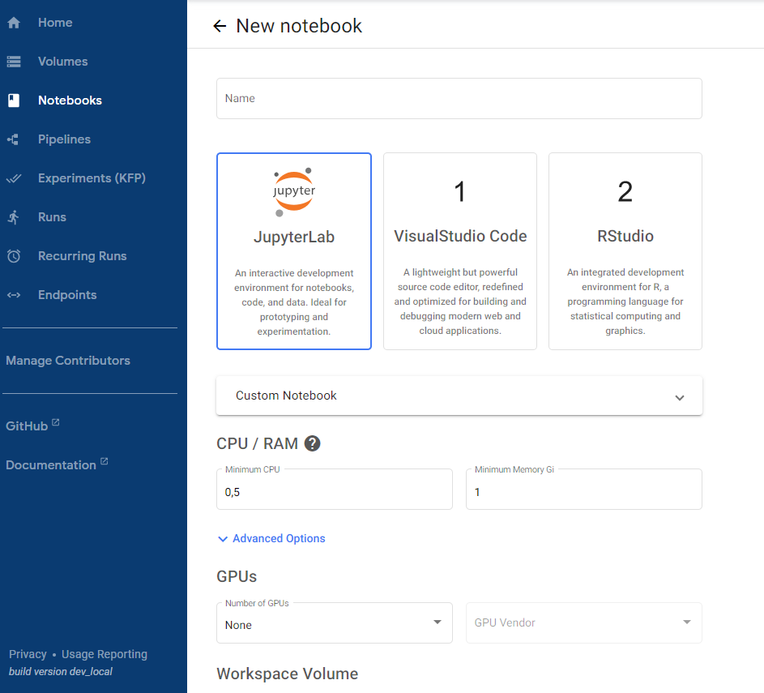

# **Mi primer notebook**

---

Vamos a ver el proceso de crear un notebook.:

1. Desde el panel izquierdo de navegación haz :material-cursor-default-click: click en la sección `Notebooks` :material-folder-multiple:.

2. Haz :material-cursor-default-click: click en el botón `New` {{notebook}} y rellena el siguiente formulario.

    1. `Name` : Nombre del notebook.
    2. `Notebook`: Selecciona qué tipo de notebook queremos utilizar. Las opciones son `jupyter`, `vscode` y `R`
    3. `Custom Notebook`: Selecciona la imagen docker para instanciar el notebook (1). 
    { .annotate }
    4. `CPU/RAM`. Indica qué capacidad de computo vas a utilizar.      
    5. `GPUs`. Indica si vas a necesitar GPU

        !!! warning

            Este asignación, y la de `CPU/RAM` está limitada por los recursos asignados a la hora de crear el usuario. El total de `GPU/CPU/RAM` creados en los notebooks (o incluso `pipelines`) debe ser inferior a la cuota asignada.

    6. `Workspace Volume`. Volumen que será usado por el {{notebook}} para persistir cualquier tipo de dato. 

    7. `Data Volumes`. Volumen adicional, independendiente, del `Workspace volume`. 

    8. `Advanced Options`.
        1. `Configurations`. Indicar si desde el {{notebook}} vas a querer crear o ejecutar {{pipeline}}.
        2. `Affinity/Tolerations`. Especifica las reglas de afinidad y tolerancia para la asignación de recursos del notebook en el clúster de Kubernetes.
            - `Affinity Config`: Permite definir reglas de afinidad para que el notebook se asigne a nodos específicos que cumplan ciertos criterios.
            - `Tolerations Group`: Permite definir las tolerancias que el notebook tendrá hacia ciertos taints aplicados en los nodos. Esto es útil para garantizar que los notebooks se ejecuten en nodos preparados para cargas específicas, como aquellos con GPU.
        3. `Miscellaneous Settings`. Ajustes misceláneos adicionales para el {{notebook}}.
            - `Enable Shared Memory`: Habilita la memoria compartida, lo cual es útil para ciertas aplicaciones que requieren segmentos de memoria compartida para la comunicación entre procesos.
        
    9. Haz :material-cursor-default-click: click en el botón `Launch`

1.  :man_raising_hand: En la propia documentación de `Kubeflow` se encuentra la lista de imagenes y la diferencia entre ellas: 

Si todo hay ido correctamente, el {{notebook}} aparecerá en la lista :white_check_mark: 