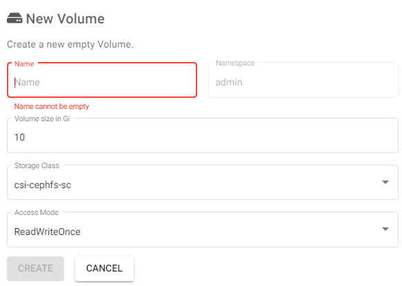

# **Mi primer volumen**

---

Vamos a ver el proceso de crear un volumen:

1. Desde el panel izquierdo de navegación haz :material-cursor-default-click: click en la sección `Volumes` :material-folder-multiple:.
2. Haz :material-cursor-default-click: click en el botón `New volume` y rellena el siguiente formulario.
    1. `Name`: Nombre del volumen.
    2. `Volume size in Gi`: Tamaño del volumen.
    
        !!! note

            Este tamaño está limitado por los recursos asignados a la hora de crear el usuario. El total de volumenes creados debe ser inferior a la cuota asignada.
    
    3. `Storage Class`: Usa el valor por defecto `csi-ceph-sc`
    4. `Access mode`: Selecciona el acceso que aplique. (1)
    { .annotate }
    5. Haz :material-cursor-default-click: click en `create`.

1.  :man_raising_hand: Ver la documentación oficial de `Kubernetes` para entende la diferencia entre los [access-modes](https://kubernetes.io/docs/concepts/storage/persistent-volumes/#access-modes)

Si todo hay ido correctamente, el volumen aparecerá en la lista :white_check_mark:
