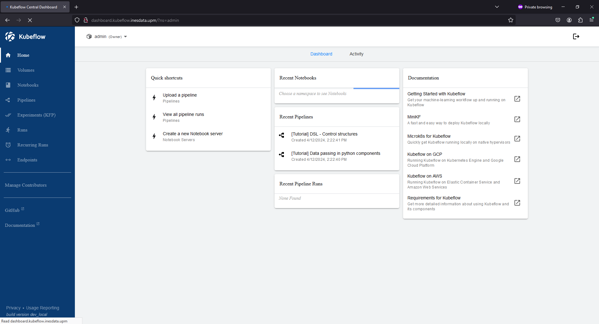
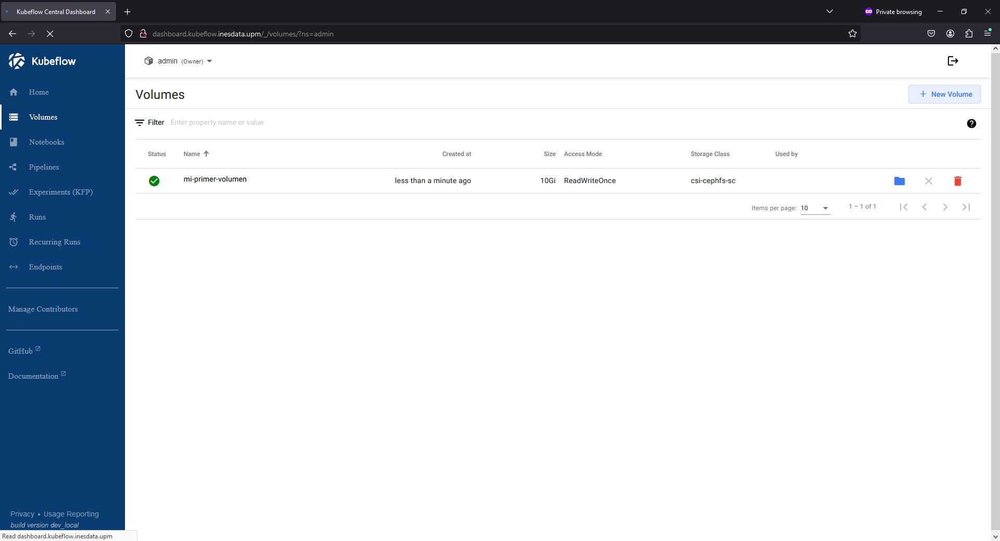
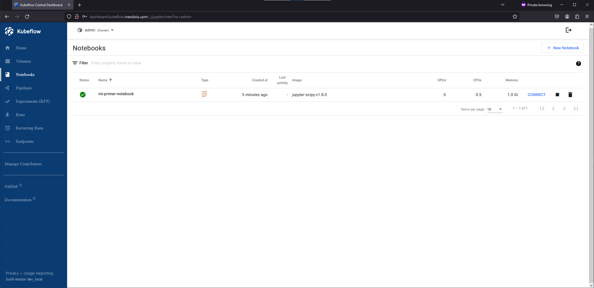
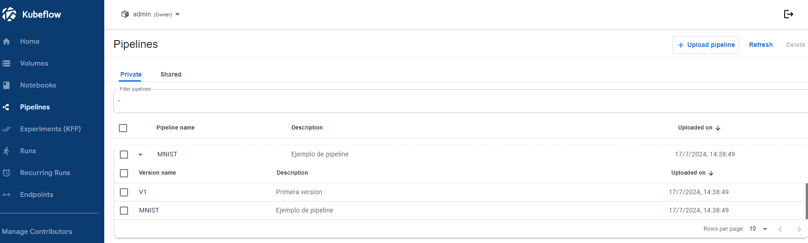
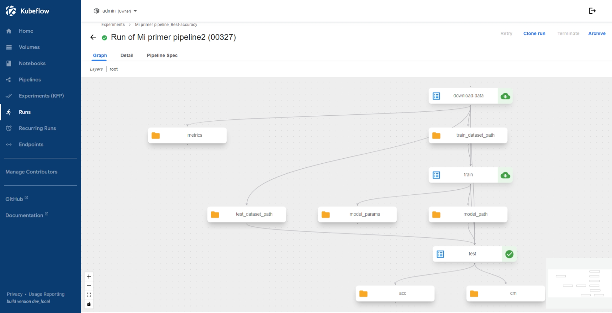

# **Introducción a la plataforma**

---

La plataforma de  desarrollo Inteligencia Artificial, `Inesdata-AI-Services` es una instancia customizada de [kubeflow](https://www.kubeflow.org/). El objetivo de esta guía no es entrar en detalle sobre `kubeflow`, para ello remitimos al lector a la [guía oficial](https://www.kubeflow.org/docs/) de `kubeflow` sino hacer una introducción a la misma, destacando los módulos principales.

La plataforma de `Inesdata-AI-Services` cuenta con los siguientes componentes:

*  [Central Dashboard](https://www.kubeflow.org/docs/components/central-dash/overview/). Es el panel central de Kubeflow que proporciona una interfaz web autenticada para el resto de componentes (ver abajo)
*  [Kubeflow Notebooks](https://www.kubeflow.org/docs/components/notebooks/). Proporciona una manera de ejecutar entorno de desarrollo web dentro del clúster de Kubernetes ejecutándolos en forma de `Pods`. Esta es el componente principal de `Inesdata-AI-Services`.
* [Kubeflow Pipelines v2](https://www.kubeflow.org/docs/components/pipelines/). Permite crear e implementar flujos (pipelines) escalables de Inteligencia Artificial usando contenedores `Docker`
* [KServe]() Permite a "serverless" inferencia y de alto rendimiento usnado para los frameworks de desarrollo más comunes de IA como TensorFlow, PyTorch, Scikit-learn, ONNX, etc.

## Acceso a la plataforma

A la plataforma se accede via web a través de la siguiente dirección web:

```
https://kubeflow.ai.inesdata-project.eu/
```

Esta dirección te redirigirá al proveedor de identidad implementado en `Inesdata-AI-Services` (`Keycloak`). Una vez autenticado, se redirigira al compomente `Central Dashboard`.

## Componentes de la plataforma

### Central Dashboard

[Central Dashboard](https://www.kubeflow.org/docs/components/central-dash/overview/) es el panel central de `Kubeflow` que proporciona una interfaz web autenticada para el resto de componentes. Este es el punto principal de entrada a la plataforma desde el cual puedes navegar al resto de componentes descritos en las siguientes secciones.





### Volúmenes

Los volumenes permiten el almacenamiento de datos. Este es un componente muy importante ya que permite la persistencia de datos, y a su vez serán los que se usen en el resto de servicios/componentes tales como los notebooks o pipelines. Además, esta capacidad de persistencia permite que si los servicios de notebook se eliminan/paran, lo almacenado en estos volúmenes puede ser reutilizado en otras instancias.




### Kubeflow Notebooks

[Kubeflow Notebooks](https://www.kubeflow.org/docs/components/notebooks/). Proporciona una manera de ejecutar entorno de desarrollo web dentro del clúster de Kubernetes ejecutándolos en forma de `Pods`. Esta es el componente principal de `Inesdata-AI-Services`.

Ver la sección ejemplos: [Mi primer notebook](./examples/notebooks.md#mi-primer-notebook), para ver un ejemplo detallado de cómo crear un notebook




### Kubeflow Pipelines

[Kubeflow Pipelines](https://www.kubeflow.org/docs/components/pipelines/) es un componente que ermite crear e implementar flujos (pipelines) escalables de Inteligencia Artificial usando contenedores `Docker`. Los pipelines permiten orquestar múltiples pasos de un proceso de aprendizaje automático, desde la preprocesamiento de datos hasta el entrenamiento y despliegue de modelos.

Los usuarios pueden crear, implementar y supervisar pipelines de manera eficiente, lo que facilita la replicación de resultados y la ejecución de [experimentos](https://www.kubeflow.org/docs/components/pipelines/concepts/experiment/) a mayor escala. Además, [Kubeflow Pipelines V2](https://v1-8-branch.kubeflow.org/docs/components/pipelines/v2/introduction/) ofrece mejoras en la gestión de metadatos y en la reutilización de componentes entre pipelines.

En la sección ejemplos: [Mi primer pipeline](./examples/pipeline.ipynb) se ofrece un ejemplo detallado de cómo crear y ejecutar un pipeline.




### KServe

[KServe](https://kserve.github.io/website/) permite una inferencia "serverless" y de alto rendimiento usando los frameworks de desarrollo más comunes de IA como TensorFlow, PyTorch, Scikit-learn, ONNX, entre otros. KServe facilita el despliegue de modelos en producción, proporcionando características como autoescalado, gestión de versiones y monitorización.

KServe integra capacidades avanzadas como la detección de deriva de datos y la validación de esquemas, asegurando que los modelos desplegados mantengan su rendimiento a lo largo del tiempo.

Para más detalles sobre cómo utilizar KServe, consulta la documentación oficial: [KServe Documentation](https://kserve.github.io/website/).

<!--  -->